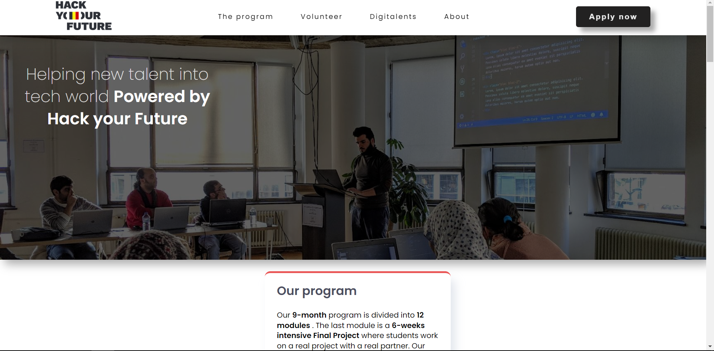

# HackYourFuture Belgium

## Description 💻

HackYourFuture Belgium is a non-profit organization which offers free coding
courses for refugees, asylum seekers, and other people with limited
qualifications who are excluded from traditional education programs. The
organization aims to help participants gain programming skills that will enable
them to find work in the IT industry.

The HackYourFuture Belgium website provides information about the organization,
its mission and values, the courses offered by the organization, and success
stories of graduates. Users can also read about ways they can help the
organization, such as through volunteering or donations.# Name of project

## Table of contents 🗒️

- [Table of contents](#table-of-contents)
- [Screenshots](#screenshots)
- [Status](#status)
- [Inspiration](#inspiration)
- [Technologies](#technologies)
- [How to Run the Website Locally](#how-to-run-the-website-locally)
- [Contribution](#contribution)
- [Code Quality Checks](#code-quality-checks)
- [Links](#links)
- [Contact](#contact)

## Screenshots 📸

## Status ⌛

Project is: _done_

## Inspiration 💭

Project inspired by hackyourfuture.be

## Technologies 🖥️

The HackYourFuture Belgium website was built using the following technologies:

- HTML
- CSS
- Git
- Node 19.4.0
- JavaScript

The website is responsive and works on different devices, including computers,
tablets, and smartphones.

## How to Run the Website Locally 📂

To run the HackYourFuture Belgium website locally on your computer, follow these
steps:

1. Make sure you have Node.js installed on your computer.
2. Clone the GitHub repository (link to clone)
3. Navigate to the hack-your-future-belgium directory in your terminal.
4. Run the command `npm install` to install the required packages.
5. Run the command `npm start` to start the server and open the website in your
   browser.

## Contribution ❤️

If you want to contribute to the development of the HackYourFuture Belgium
website, feel free to submit pull requests to the organization's GitHub
repository. Any help is appreciated!

## Code Quality Checks ✔️

- `npm run format`: Makes sure all the code in this repository is well-formatted
  (looks good).
- `npm run lint:ls`: Checks to make sure all folder and file names match the
  repository conventions.
- `npm run lint:md`: Will lint all of the Markdown files in this repository.
- `npm run lint:css`: Will lint all of the CSS files in this repository.
- `npm run validate:html`: Validates all HTML files in your project.
- `npm run spell-check`: Goes through all the files in this repository looking
  for words it doesn't recognize. Just because it says something is a mistake
  doesn't mean it is! It doesn't know every word in the world. You can add new
  correct words to the [./.cspell.json](./.cspell.json) file so they won't cause
  an error.

## Links 🌐

[Repo](https://github.com/BF-FrontEnd-class/agile-development-group1-hyf-rebuild)

[Live](https://bf-frontend-class.github.io/agile-development-group1-hyf-rebuild/)

## Contact 💌

| Name                                           |
| ---------------------------------------------- |
| [Maria](https://github.com/Mariya-go)          |
| [Vlad](https://github.com/VladyslavHornitskyi) |
| [Rahtab](https://github.com/Rahatab)           |
| [Rekha](https://github.com/Rekhasriraman)      |
| [Milena](https://github.com/Mileenka)          |
